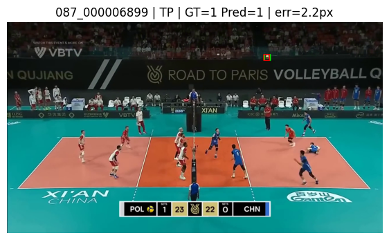
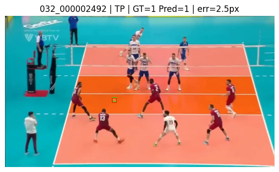

# Volleyball-Ball-Tracking

---

# Prepare your own dataset for Ball Tracking Training

To train the ball tracking model on your own dataset, use:

`tools/prepare_yolo_pose_dataset.py`

This script converts ball center annotations into **YOLOv8 pose format** with one keypoint.

### Dataset Structure

```
dataset_root/
├── centers.csv
└── splits/
    ├── train.txt
    ├── val.txt
    └── test.txt
```

* Split files contain relative image paths
* Image filename stem is used as the UID

### centers.csv

Required columns:

* `uid`
* `has_ball` (1 or 0)
* `x_center`, `y_center` (normalized)

Images without a ball generate empty label files.

### Output

```
out_root/
├── labels/{train,val,test}
└── data.yaml
```

Label format:
`class x y w h xk yk vk`

### Run

```
python tools/prepare_yolo_pose_dataset.py \
  --dataset-root /path/to/dataset \
  --out-root /path/to/yolo_dataset
```

After this step, the dataset is ready for YOLOv8 pose training.

---

## Data Preparation

To train the ball tracking model on a custom dataset, the data must first be converted to
YOLOv8 pose format. This repository provides a preparation script for that purpose.

`tools/prepare_yolo_pose_dataset.py`

### Expected Dataset Structure

```

dataset_root/
├── centers.csv
└── splits/
├── train.txt
├── val.txt
└── test.txt

```

- Split files contain relative image paths
- Image filename stem is used as the unique identifier

### centers.csv

Required columns:

- `uid`
- `has_ball` (1 or 0)
- `x_center`, `y_center` (normalized to [0, 1])

Images without a ball generate empty label files.

### Usage

```

python tools/prepare_yolo_pose_dataset.py 
--dataset-root /path/to/dataset 
--out-root /path/to/yolo_dataset

```

The script generates YOLOv8 pose labels and a `data.yaml` file ready for training.

---

# Training

After preparing the dataset, the model can be trained using the provided training script:

`train.py`

### Usage

```

python train.py --data /path/to/yolo_dataset/data.yaml

```

### Arguments

- `--data` : path to `data.yaml` (required)
- `--model` : base YOLOv8 pose model (default: `yolov8s-pose.pt`)
- `--imgsz` : input image size (default: `640`)
- `--epochs` : number of training epochs (default: `100`)
- `--batch` : batch size (default: `32`)
- `--optimizer` : optimizer type (default: `AdamW`)
- `--lr0` : initial learning rate (default: `1e-3`)
- `--patience` : early stopping patience (default: `20`)
- `--device` : device id or `cpu` (default: `0`)
- `--project` : output directory (default: `runs/pose`)
- `--name` : run name (default: `train`)

Training outputs are saved under `runs/pose/` by default.

---

Here is the **clean, final README section only**, ready to paste into your main README.
It follows a **professional ML repo style**, concise, structured, and non awkward.

---

# Evaluation

This repository provides two evaluation scripts: one for visual inspection on sample frames
and one for numeric evaluation on the full test set.

### Visual inspection on sample frames

`eval_samples.py`

This script runs inference on a random subset of test images and visualizes:
- ground truth ball location (green)
- predicted ball location (red)

It also prints per image TP TN FP FN cases and localization error for true positives.

```

python eval_samples.py 
--weights /path/to/best.pt 
--centers-csv /path/to/centers.csv 
--images /path/to/yolo_dataset/images/test 
--n 25 
--conf 0.25

```

Arguments:
- `--weights` : path to model weights (required)
- `--centers-csv` : path to `centers.csv` (required)
- `--images` : test images directory (required)
- `--n` : number of samples to visualize (default: 25)
- `--conf` : confidence threshold (default: 0.25)
- `--imgsz` : inference image size (default: 640)
- `--seed` : random seed (default: 42)
- `--half-box` : half size of drawn square in pixels (default: 10)


### Example outputs

<p align="center">
  
  
</p>

*Qualitative evaluation examples. Ground truth is shown in green and model predictions in red.*


---


### Numeric evaluation on the full test set

`eval_testset.py`

This script evaluates the model on all test images and reports:
- TP TN FP FN
- Accuracy Precision Recall F1
- Center localization error statistics on true positives

An optional per image CSV report can be saved.

```

python eval_testset.py 
--weights /path/to/best.pt 
--centers-csv /path/to/centers.csv 
--images /path/to/yolo_dataset/images/test 
--conf 0.25 
--save-csv /path/to/output/test_numeric_results.csv

```

Arguments:
- `--weights` : path to model weights (required)
- `--centers-csv` : path to `centers.csv` (required)
- `--images` : test images directory (required)
- `--conf` : confidence threshold (default: 0.25)
- `--imgsz` : inference image size (default: 640)
- `--split` : split name if `centers.csv` contains a `split` column (default: test)
- `--save-csv` : optional path to save per image numeric results
```

---


